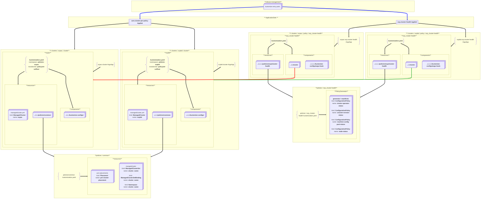

```mermaid
---
config:
  flowchart:
    htmlLabels: false
---
graph TD
    subgraph Release_Management [ **release-management** ]
        RM_Kust@{ shape: processes, label: "kustomize entry point" }
    end

    subgraph appsets [ ** ApplicationSets ** ]
        cluster_appset@{ shape: subproc, label: "**acm.cluster-per-policy AppSet**" }
        policy_appset_1@{ shape: subproc, label: "**ocp.cluster-health AppSet**" }
    end 
    
    subgraph cluster_ocpac [ **/ clusters / ocpac / cluster** ]
        ocpac_app@{ shape: braces, label: "ocpac-cluster ArgoApp" }
        subgraph ocpac_sg [ **ocpac** ]
            ocpac_ks@{ shape: braces, label: "_**kustomization.yaml**_
                namespace: **policies-ocpac**
                transformer: **policyset-suffixer**
            " }
        
            subgraph ocpac_rs [ **resources** ]
                ocpac_rs1@{ shape: processes, label: "managedcluster.yml
                    kind: **ManagedCluster**
                    name: **ocpac**
                " }

                ocpac_rs2@{ shape: processes, label: "**../../../policies/common**" }
            end

            subgraph ocpac_cm [ **components** ]
                ocpac_cm1@{ shape: processes, label: "**../../../kustomize-configs/**" }
            end
        end
    end

    subgraph cluster_ocpbd [ **/ clusters / ocpbd / cluster** ]
        ocpbd_app@{ shape: braces, label: "ocpbd-cluster ArgoApp" }
        subgraph ocpbd_sg [ **ocpbd** ]
            ocpbd_ks@{ shape: braces, label: "_**kustomization.yaml**_
                namespace: **policies-ocpbd**
                transformer: **policyset-suffixer**
            " }
        
            subgraph ocpbd_rs [ **resources** ]
                ocpbd_rs1@{ shape: processes, label: "managedcluster.yml
                    kind: **ManagedCluster**
                    name: **ocpbd**
                " }

                ocpbd_rs2@{ shape: processes, label: "**../../../policies/common**" }
            end

            subgraph ocpbd_cm [ **components** ]
                ocpbd_cm1@{ shape: processes, label: "**../../../kustomize-configs/**" }
            end
        end
    end

    subgraph policies_common [ **policies / common** ]
        policies_common_ks@{ shape: braces, label: "policies/common kustomization.yaml" }

        subgraph policies_common_rs [ **resources** ]
            policies_common_rs1@{ shape: processes, label: "acm-placements
                kind: **Placement**
                name: **per-cluster-placement**
            " }

            policies_common_rs2@{ shape: processes, label: "mangedcluster
                kind: **ManagedClusterSet**
                name: **cluster_name**
                -
                kind: **ManagedClusterSetBinding**
                name: **cluster_name**
                -
                kind: **Namespace**
                name: **cluster_name**
            " }
        end
        policies_common_ks --> policies_common_rs
    end


    subgraph policies_ocp_cluster-health [ **policies / ocp_cluster-health** ]
        policies_ocp_cluster-health_ks@{ shape: braces, label: "policies / ocp_cluster-health kustomization.yaml" }

        subgraph policies_ocp_cluster-health_gn [ **PolicyGenerator** ]
            policies_ocp_cluster-health_gn1@{ shape: processes, label: "**generator / manifests**
                kind: **ConfigurationPolicy**
                name: **cluster-operator-status**
                -
                kind: **ConfigurationPolicy**
                name: **ccluster-version-status**
                -
                kind: **ConfigurationPolicy**
                name: **machine-config-pool-status**
                -
                kind: **ConfigurationPolicy**
                name: **node-status**
            " }
        end
        policies_ocp_cluster-health_ks --> policies_ocp_cluster-health_gn 
    end


    %% Policies generated per cluster
    subgraph policy_cluster_health_ocpac [ **/ clusters / ocpac / policy / ocp_cluster-health** ]
        ocpac_policy1@{ shape: braces, label: "ocpac-ocp.cluster-health ArgoApp" }

        subgraph policy_cluster_health_ocpac_sg [ **ocp_cluster-health** ]
            policy_cluster_health_ocpac_ks@{ shape: braces, label: "_**kustomization.yaml**_" }
        
            subgraph policy_cluster_health_ocpac_rs [ **resources** ]
                policy_cluster_health_ocpac_rs1@{ shape: processes, label: "**../../../../policies/ocp/cluster-health**" }
            end

            subgraph policy_cluster_health_ocpac_cm [ **components** ]
                policy_cluster_health_ocpac_cm1@{ shape: processes, label: "**../../cluster**" }

                policy_cluster_health_ocpac_cm2@{ shape: processes, label: "**../../../../kustomize-configs/argo-hook**" }
            end
        end
    end

    subgraph policy_cluster_health_ocpbd [ **/ clusters / ocpbd / policy / ocp_cluster-health** ]
        ocpbd_policy1@{ shape: braces, label: "ocpbd-ocp.cluster-health ArgoApp" }

        subgraph policy_cluster_health_ocpbd_sg [ **ocp_cluster-health** ]
            policy_cluster_health_ocpbd_ks@{ shape: braces, label: "_**kustomization.yaml**_" }
        
            subgraph policy_cluster_health_ocpbd_rs [ **resources** ]
                policy_cluster_health_ocpbd_rs1@{ shape: processes, label: "**../../../../policies/ocp/cluster-health**" }
            end

            subgraph policy_cluster_health_ocpbd_cm [ **components** ]
                policy_cluster_health_ocpbd_cm1@{ shape: processes, label: "**../../cluster**" }

                policy_cluster_health_ocpbd_cm2@{ shape: processes, label: "**../../../../kustomize-configs/argo-hook**" }
            end
        end
    end


    %% Flow connections
    RM_Kust --> cluster_appset
    RM_Kust --> policy_appset_1

    cluster_appset --> cluster_ocpac
    cluster_appset --> cluster_ocpbd

    ocpac_app --> ocpac_sg
    ocpac_rs2 --> policies_common
    ocpac_ks --> ocpac_rs
    ocpac_ks --> ocpac_cm

    ocpbd_app --> ocpbd_sg
    ocpbd_rs2 --> policies_common
    ocpbd_ks --> ocpbd_rs
    ocpbd_ks --> ocpbd_cm


    policy_appset_1 --> ocpac_policy1
    policy_appset_1 --> ocpbd_policy1

    ocpac_policy1 --> policy_cluster_health_ocpac_sg 
    policy_cluster_health_ocpac_ks --> policy_cluster_health_ocpac_rs
    policy_cluster_health_ocpac_ks --> policy_cluster_health_ocpac_cm
    policy_cluster_health_ocpac_cm1 ==> ocpac_sg
    policy_cluster_health_ocpac_rs1 --> policies_ocp_cluster-health

    ocpbd_policy1 --> policy_cluster_health_ocpbd_sg 
    policy_cluster_health_ocpbd_ks --> policy_cluster_health_ocpbd_rs
    policy_cluster_health_ocpbd_ks --> policy_cluster_health_ocpbd_cm
    policy_cluster_health_ocpbd_cm1 ==> ocpbd_sg
    policy_cluster_health_ocpbd_rs1 --> policies_ocp_cluster-health

    linkStyle default stroke-width:4px
    linkStyle 2,3 stroke:#030bfc
    linkStyle 19 stroke:#fc0303
    linkStyle 24 stroke:#2dad33
```