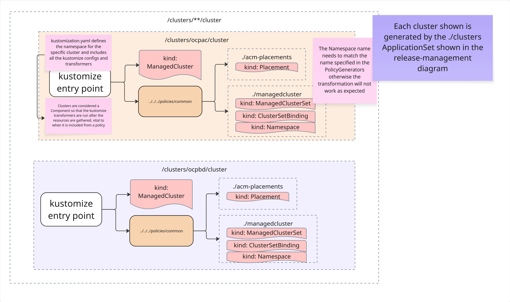
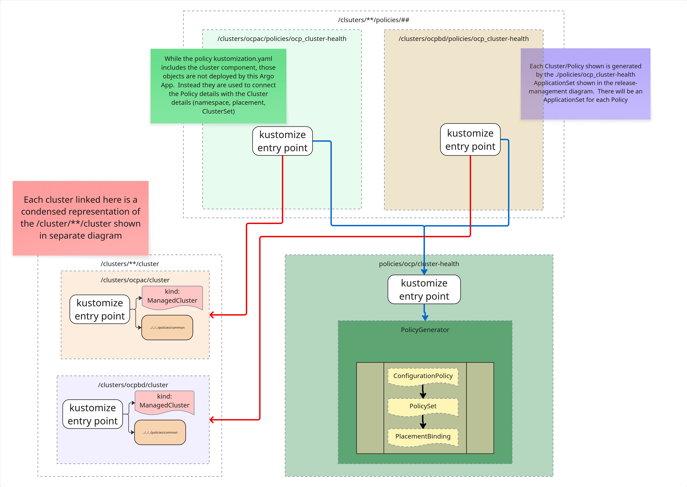

### Understanding how the kustomize documents are implemented and how the Argo Applications relate

To better understand how to implement this repository structure this document will explain the three directories and how the relate.
1. release-management
2. clusters/**/cluster
3. clusters/**/policies/## --> policies/##

require "releasemanagement"

TODO - write about how the release is structured

require "clusters"

TODO - write about how the clusters are structured

require "policy per cluster"

TODO - write about how each policy is structured per cluster
